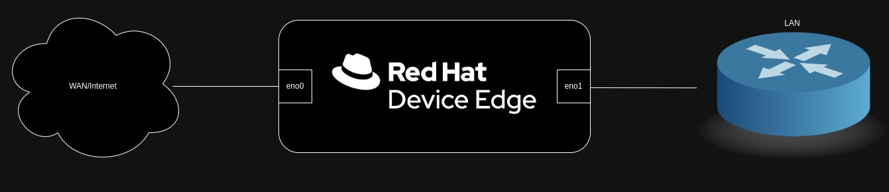

# Bootstrap
This repo is a collection of utilities and scripts designed to build a "bootstrap" node that contains essential content for demonstrations, proof of concepts, and offline installations. It is built on top of a few other projects, mainly [oc-mirror](https://github.com/openshift/oc-mirror), along with some custom work.

The included helm chart can be used to deploy to a platform of your choice.

## Architecture


Frequently, it's required to provide access to content and some core services to allow for hands-on experiences with Red Hat platforms, such as Red Hat Device Edge, Red Hat OpenShift, and Red Hat Enterprise Linux. In addition, certain core services are requried to get up and running quickly. In addition to content, some network services provide for an easier experience overall. Ideally, a single low power node can provide these core services.


## Requirements
- A kubernetes platform of your choice, however this is intended to run on [Microshift](https://access.redhat.com/documentation/en-us/red_hat_build_of_microshift), optionally with operating system customizations.
- [Local storage](https://access.redhat.com/documentation/en-us/red_hat_build_of_microshift/4.15/html/storage/index) available via the platform.
- Your [pull secret](https://console.redhat.com/openshift/install/pull-secret).
- [Customer portal credentials](https://www.redhat.com/wapps/ugc/protected/usermgt/userList.html).
- A [Red Hat API Token](https://access.redhat.com/management/api).
- A decent internet connection and some patience.

## Setup
The chart has an example values.yaml file that requires some confirugation (or override from the CLI) before deploying. Below are some more in-depth explanations on what can be configured.

**Future, not yet complete**
If you do not want a specific element deployed, simply undefine it in `values.yaml`.

### Microshift Specific Configuration
If deploying to Microshift and intending to use DHCP, configure the following:
```yaml
microshift: true
microshiftConfig:
  ipAddresses:
    - 192.168.0.1 # Match to the LAN interface Address
```

### DHCP
If deploying DHCP, configurure the following:
```yaml
dhcp:
  interface: enp7s0 # Interface name of LAN address
  rangeStart: 192.168.0.10 # Ensure this is in the subnet assigned to the LAN address
  rangeEnd: 192.168.0.250 # Ensure this is in the subnet assigned to the LAN address
  router: 192.168.0.1 # Should match the LAN address
  dnsServer: 192.168.0.1 # Should match the LAN address
```

### DNS
If deploying DNS, configure the following:
```yaml
dns:
  forwardZone: example.domain.lcl # Internal domain to use on the LAN
  reverseZone: 0.168.192.in-addr.arpa # Reverse zone of internal network
  forwarders: # Upstream DNS servers, Cloudflare and Google DNS servers are safe choices
    - 1.1.1.1
    - 1.0.0.1
    - 8.8.8.8
    - 8.8.4.4
  forwardRecords: # A/AAA/TXT/etc records that should exist in the interna forward zone
    - record: rcd1
      type: A
      value: 192.168.0.20
    - record: rcd2
      type: A
      value: 192.168.0.21
  reverseRecords: # PTR records that should exist in the reverse zone
    - record: 20
      type: PTR
      value: rcd1
    - record: 21
      type: PTR
      value: rcd2
```

### OC Mirror
If mirroring OpenShift content with oc-mirror, define the following:
```yaml
ocMirror:
  pullSecret: 'your-pull-secret-base64'
  platformChannels:
    - name: stable-4.15
      type: ocp
  additionalImages:
    - name: registry.redhat.io/ubi9/ubi:latest
    - name: registry.redhat.io/ubi8/ubi:latest
    - name: registry.access.redhat.com/ubi9-minimal:latest
    - name: registry.access.redhat.com/ubi8-minimal:latest
```
For full oc-mirror documentation, review the [docs](https://github.com/openshift/oc-mirror/blob/main/docs/usage.md).

### CDN Repos
If mirroring content from the CDN, configure the following:
```yaml
dnfMirror:
  rhsm:
    username: your-rhsm-username
    password: your-rhsm-password
  repos:
    - name: baseos # Name of repo
      id: rhel-9-for-x86_64-baseos-rpms # Repo ID
      pvcSize: 10Gi # Amount of storage needed. Not required, defaults to 15Gi
    - name: appstream
      id: rhel-9-for-x86_64-appstream-rpms
      pvcSize: 20Gi
    - name: rhocp
      id: rhocp-4.15-for-rhel-9-x86_64-rpms
      pvcSize: 5Gi
    - name: fast-datapath
      id: fast-datapath-for-rhel-9-x86_64-rpms
      pvcSize: 5Gi
```

### Customer Portal Content
If downloading content from the customer portal, configure the following:
```yaml
customerPortalDownloads:
  offlineToken: 'your-offline-token'
  downloads:
    - name: rhel-9.3-x86_64-boot.iso
      sha256: 6a9f135b8836edd06aba1b94fd6d0e72bd97b4115a3d2a61496b33f73e0a13a5
    - name: rhel-8.9-x86_64-boot.iso
      sha256: 65da7744b9e41ba064627762fd7378c66b77008ec8ab026f1c8c2cf72a86a92b
```

## Installing
Once your values.yaml file is configured, the helm CLI can be used to deploy:
```
helm install -f values.yaml $(deployment-name) chart/
```

Once all init containers and jobs finish, content has been synced.

## Components
There are a few moving parts to this explained below.

| Component | Description | Deployment Methodology | Special Requirements |
| --------- | ----------- | ---------------------- | -------------------- |
| dhcp | dnsmasq providing dhcp | Pod with rendered config files via ConfigMap | Host networking |
| dns | bind providing dns | Pod with rendered config files via ConfigMap | Host networking |
| oc-mirror | OpenShift Client (oc) plugin that manages OpenShift release, operator catalog, helm charts, and associated container images for mirror registries that support OpenShift environments | A job running oc-mirror pushes specified content into an instance of registry2 | None |
| cdn-mirror | yum/dnf repos served via httpd | Init container to sync repos from CDN to volume, then attach to web server pod, each repo gets a set of resources | UID 0 for subscription-manager |
| portal-download | customer portal content downloaded and served via web server | Init pod downloads content to volume, attaches to web server | None |
